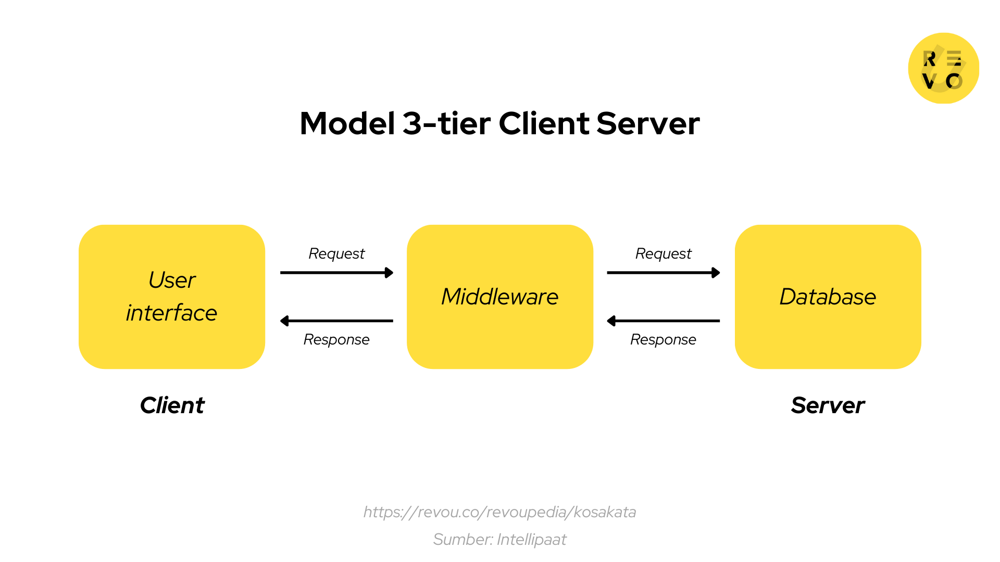

# Project: Next.js 15 + Express.js + MongoDB

## A. Giới thiệu
Dự án sử dụng mô hình Client-Server với các thành phần chính:
- **Client:** Next.js 15 (React + Tailwind CSS) hiển thị giao diện và gửi request tới backend.
- **Server:** Express.js xử lý request, thực hiện xác thực và truy vấn MongoDB.
- **Database:** MongoDB lưu trữ dữ liệu người dùng.

## B. Cấu trúc dự án
### 1. Client
- **Framework:** Next.js 15 + React.js
- **Cài đặt:** [Next.js Installation Guide](https://nextjs.org/docs/pages/getting-started/installation)
- **UI Library:** [Ant Design](https://ant.design/components/overview/)
- **CSS Framework:** [Tailwind CSS](https://tailwindcss.com/docs/installation/using-vite)
- **Figma** [Figma]([https://blog.logrocket.com/convert-figma-components-next-js-tailwind-css/])

### 2. Server
- **Backend:** Express.js (Dùng module)
- **Database:** MongoDB

### 3. Công cụ hỗ trợ
- **Draw.io Integration:** Hỗ trợ vẽ sơ đồ trực tiếp trong VSCode
- - **Figma for VS Code:** 

## C. Môi trường
- **Node.js:** 18+
- **Docker:** Cấu hình để chạy môi trường container hóa

## D. Cài đặt
### 1. Cài đặt server
```bash
cd server
npm install
```

### 2. Cài đặt client
```bash
cd client
npm install
```

## E. Chạy dự án
### 1. Chạy backend
```bash
cd server
npm run dev
```

### 2. Chạy frontend
```bash
cd client
npm run dev
```


---
## B. Giới Thiệu
### 1. Client - Server
Mô hình **Client-Server** là kiến trúc phổ biến trong các ứng dụng web hiện đại, hoạt động dựa trên cơ chế **Request-Response**:
- **Client** gửi request đến Server để yêu cầu dữ liệu hoặc thực hiện một tác vụ.
- **Server** xử lý request, có thể truy vấn **Database** nếu cần.
- **Server** gửi response (thường là **JSON, HTML, XML, ...**) về cho Client.

Mô hình Client-Server bao gồm 3 tầng:
#### Tầng 1: Presentation Layer (Giao diện - Frontend)**
- Hiển thị giao diện cho người dùng.
- Gửi request đến Backend thông qua API.

#### Tầng 2: Business Logic Layer (Xử lý nghiệp vụ - Backend)**
- Xử lý logic nghiệp vụ, xác thực người dùng (Authentication).
- Kiểm tra quyền hạn (Authorization).
- Giao tiếp với Database để lấy dữ liệu.

#### Tầng 3: Data Layer (Cơ sở dữ liệu - Database)**
- Lưu trữ dữ liệu, xử lý truy vấn.

Luồng Request-Response

### 2. Bộ định tuyến (App router) trong nextjs 13+
Next.js sử dụng hệ thống định tuyến dựa trên cấu trúc thư mục và tệp tin, nghĩa là bạn có thể sử dụng thư mục và tệp để xác định các tuyến đường (routes). Dưới đây là hướng dẫn tạo layouts, pages và cách liên kết giữa chúng.
```
├─ app/            # Cấu trúc App Router
│  ├─  layout.tsx  # Layout chung
│  ├─  page.tsx    # Trang chủ/điều hướng
│  ├─  ...
```

---
#### Tạo một trang (Page)
Trang (page) là giao diện hiển thị trên một tuyến đường cụ thể. Để tạo một trang, thêm một tệp page.tsx vào thư mục app và xuất mặc định một thành phần React.
```javascript
// app/page.tsx
export default function Page() {
  return <h1>Hello Next.js!</h1>
}
```
#### Tạo một bố cục (Layout)
Bố cục (layout) là giao diện được chia sẻ giữa nhiều trang. Khi chuyển trang, bố cục sẽ giữ nguyên trạng thái, vẫn tương tác được và không tải lại.

Bạn có thể định nghĩa một layout bằng cách tạo một tệp layout.tsx trong thư mục app. Thành phần này nhận một prop children, có thể là một trang hoặc một layout khác.

```javascript
// app/layout.tsx
export default function RootLayout({
  children,
}: {
  children: React.ReactNode
}) {
  return (
    <html lang="en">
      <body>
        <main>{children}</main>
      </body>
    </html>
  )
}
Lưu ý: Bố cục gốc Root Layout (`app/layout.tsx`) là bắt buộc và phải chứa thẻ <html> và <body>.
```

#### Lồng ghép layout
Mặc định, các layout trong cây thư mục sẽ tự động lồng nhau. Bạn có thể thêm layout riêng cho từng thư mục.
```
├─ app/     # Cấu trúc App Router
│   ├─  layout.tsx  # Layout chung
│   ├─  page.tsx    # Trang chủ/điều hướng
│   ├─  auth/
│   │   ├─  layout.tsx   
│   │   ├─  login/
│   │   │   ├─  page.tsx
│   │   ├─  resgister/
│   │   │   ├─  page.tsx
│   ├─  dashboard/
│   │   ├─  layout.tsx   
│   │   ├─  folder/
│   │   │   ├─  page.tsx
│   │   ├─  [slug]
...
```
Root layoyt (`app/layout.tsx`) sẽ bao bọc `app/auth/layout.tsx`

Và `app/auth/layout.tsx` sẽ bai bọc `app/auth/register/page.tsx` hoặc  `app/auth/login/page.tsx`

#### Đọc thêm: https://nextjs.org/docs/app/getting-started/layouts-and-pages

---

### 3. Mô hình MVC trong Express.js
```
├─ server/   # Backend Express.js
│   ├─ src  
│   │   ├─ routes/ 
│   │   │   ├─ index.js  
│   │   │   ├─ auth.js  
│   │   ├─ controllers/ 
│   │   │   ├─ authController.js  
│   │   ├─ models/  
│   │   │   ├─ userModel.js 
│   │   ├─ middleware/  
│   │   │   ├─ authMiddleware.js  
│   │   ├─ uploads/  
│   ├─ server.js  
│   ├─ .env 
```
- `models/` - Mô tả cấu trúc dữ liệu cho từng đối tượng trong MongoDB.
- `routes/` - Điều hướng API, tiếp nhận request và chuyển đến controller tương ứng.
- `middlewares/` - Xử lý và kiểm tra dữ liệu trước khi chuyển đến controller.
- `controllers/` - Xử lý logic nghiệp vụ.
- `uploads/` - Lưu trữ tệp tin, hình ảnh, video,... được tải lên.

Khi client gửi request đến server, giả sử `http://localhost:5000/api/auth/login`, server sẽ xử lý phần sau `/api/`, tức là `auth/login`, và chuyển nó đến `routes/index.js`:

```javascript
// routes/index.js
import express from "express";
import authRoutes from "./authRoutes.js";
import userRoutes from "./userRoutes.js";

const router = express.Router();

router.use("/auth", authRoutes); // Xử lý auth/login
router.use("/user", userRoutes);

export default router;
```

Cấu hình route xác thực:

```javascript
// routes/authRoutes.js
import express from "express";
import { register, login } from "../controllers/authController.js";
import { registerValidator, loginValidator } from "../middlewares/validators/authValidator.js";

const router = express.Router();

// POST
router.post("/register", registerValidator, register);
// Middleware registerValidator xác thực dữ liệu trước khi gửi đến controller register
router.post("/login", loginValidator, login);
// Middleware loginrValidator xác thực dữ liệu trước khi gửi đến controller login

export default router;
```

Controllers sẽ xử lí resonse và trả là request tương ứng cho client.


